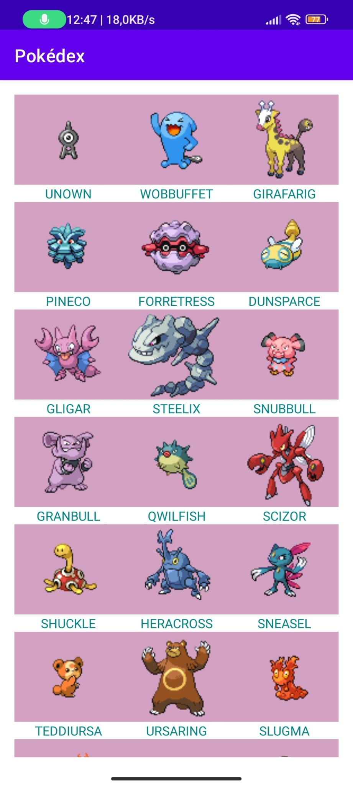

# pokedex-api-old

Api that brings data from https://pokeapi.co/. I created this app in Android Studio using Java and consuming the api with Retrofit, displaying the data in a RecyclerView.

**Updated** version at https://github.com/ricardobar96/pokedex-api. I modified the Api to return only **the first 151 pokemon** (first generation), cleared the layout to display only **one pokemon per row** and changed its **visual appearance**, bringing new functionalities in the form of **menu items** and the possibility to access to a **specific pokemon** view by clicking on it. Enrique contributed by migrating the app to **Kotlin** and **cleaning** the code while keeping all functionalities.

 

| [📓 Features](#features) | [📷 Screenshots](#screenshots) | [🤝 Contributing](#contributing) | [🔖 License](#license) |
|  -------- | -------- | ----------- | ----------- |

 

## Features

- API consumption.
- RecyclerView display.
- API text display.
- API images display.

 

## Screenshots

### Updated version (https://github.com/ricardobar96/pokedex-api):

 
 
 
 

### Old version (this repository):

 

## Contributing
If you want to contribute to this proyect, follow these steps:

 

1. Fork the repository.
3. Clone your fork.
4. Check that your fork is the "origin" remote.
5. Add the project repository as the "upstream" remote using `git remote add upstream https://github.com/ricardobar96/pokedex-api-old.git`.
6. Pull the latest changes from upstream into your local repository using `git pull upstream master`.
7. Create a new branch using `git checkout -b BRANCH_NAME`.
8. Make your changes and commit them: `git commit -m 'DESCRIPTION OF CHANGES'`.
9. Push your changes to your fork `git push origin BRANCH_NAME`.
10. Create a pull request.
 
 

If you have any doubts, consult [this](https://www.dataschool.io/how-to-contribute-on-github/) guide

 

## License
This project is licensed under the [MIT License](LICENSE)
